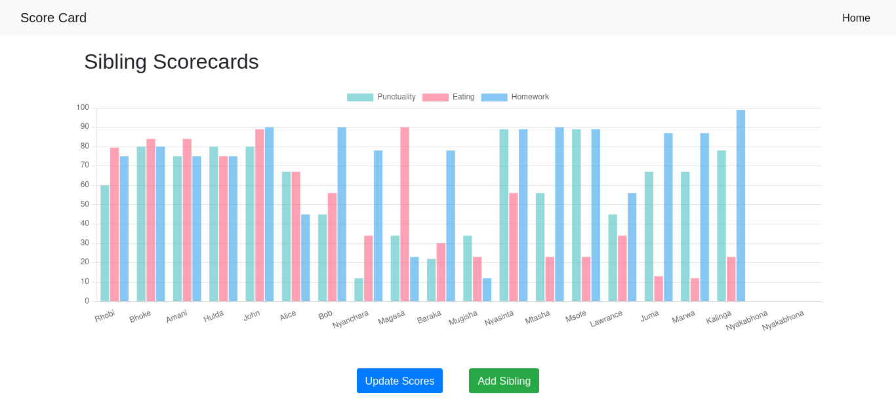
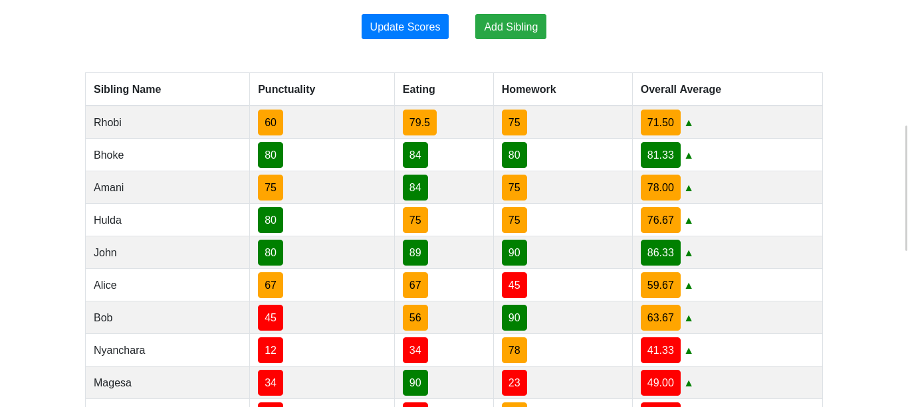
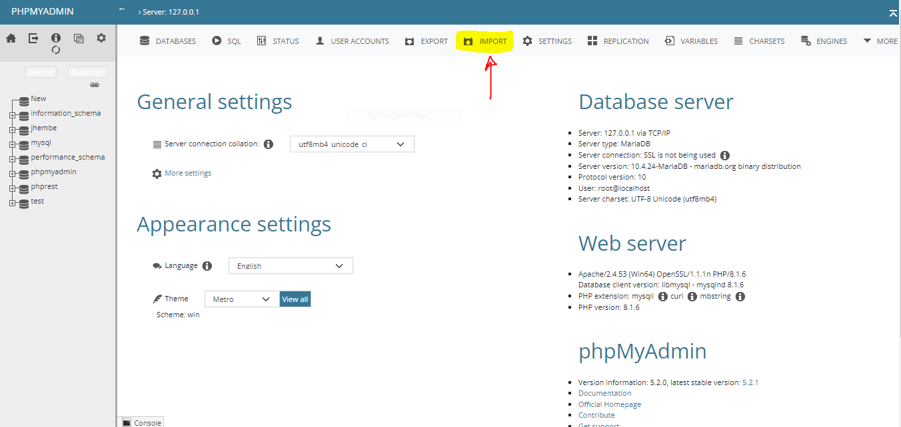
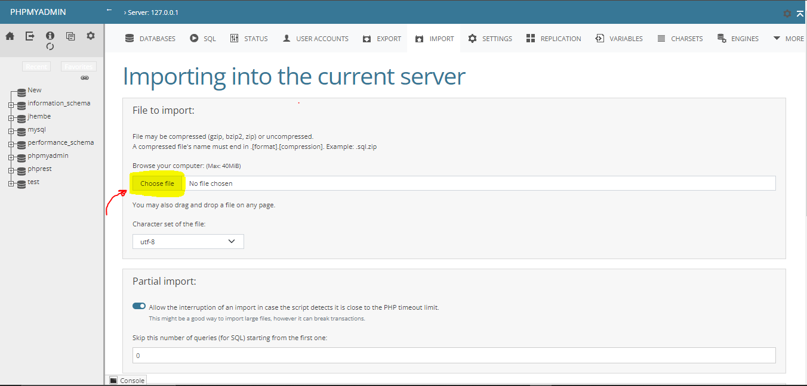
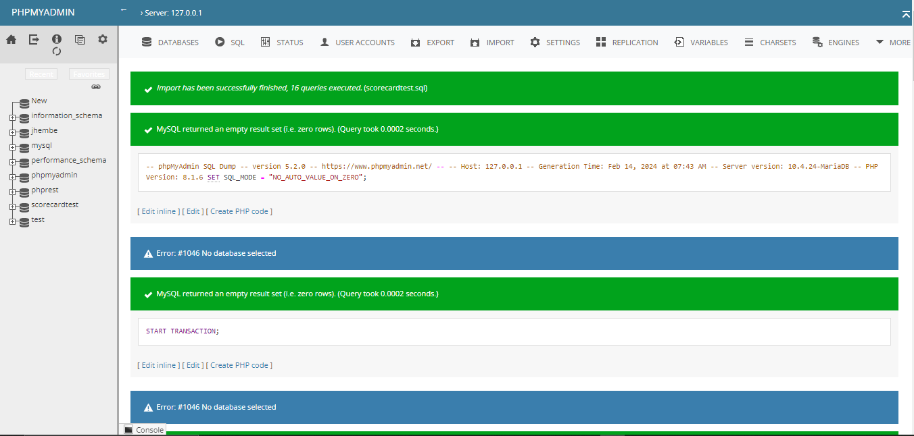

# Sibling Scorecard System

The Sibling Scorecard System is a web application designed to help you manage and assess the performance of siblings in various aspects. This system allows you to record and track scores for individual siblings in different categories and provides a scoring sheet for easy assessment.




## Table of Contents

- [Getting Started](#getting-started)
  - [Prerequisites](#prerequisites)
  - [Installation](#installation)
- [Usage](#usage)
  - [Adding a Sibling](#adding-a-sibling)
  - [Updating Scores](#updating-scores)
  - [Importing Data](#importing-data)
  - [Using the Scoring Sheet](#using-the-scoring-sheet)
- [Features](#features)
- [Database Schema](#database-schema)
- [Scoring Sheet](#scoring-sheet)
- [Contributing](#contributing)
- [License](#license)

## Getting Started

These instructions will guide you through setting up and using the Sibling Scorecard System.

### Prerequisites

To run this system, you need the following software/tools installed on your server:

- PHP (7.0 or higher)
- MySQL database
- Web server (e.g., Apache (Recommended), Nginx)
- Web browser

### Installation

1. **Clone the Repository:**

   Clone this repository to your server:

   ```shell
   git clone https://github.com/yourusername/SiblingScoreCard.git

   ### Or you can ask Philes on how to download it mannualy
   
2. **Database Setup:**

   A pre-configured sql file (scorecardtest.sql) is included in the Schema folder, within the downloaded project.
   Import the file into mysql database to set up the schema, it can be simply done using phpmyadmin. The screenshot bellow will guide you :

   

   
   After choosing the file, below you have to click the import button.

   
   This will appear if everything goes well, and the database will appear on the left pannel

### Another alternative could be

   ```sql
   CREATE DATABASE scorecardtest;
   USE scorecardtest;

   ----------------------------------------
   --Table structure for table `siblings`--
   ----------------------------------------

   CREATE TABLE `siblings` (
   `id` int(11) NOT NULL AUTO_INCREMENT PRIMARY KEY,
   `name` varchar(50) NOT NULL,
   `punctuality_score` int(11) NOT NULL DEFAULT 0,
   `eating_score` int(11) NOT NULL DEFAULT 0,
   `homework_score` int(11) NOT NULL DEFAULT 0,
   `previous_average` int(11) NOT NULL DEFAULT 0,
   `num_entries` int(11) NOT NULL DEFAULT 0,
   `overall_average` int(11) NOT NULL DEFAULT 0
   );
   ```

3. **Install PHP Libraries:**

   Configure the database connection in config.php with your database credentials. The file can be found within the schema folder.

   ```php
   $servername = "localhost";
   $username = "root";
   $password = "";
   $dbname = "scoreCardTest";

   $conn = new mysqli($servername, $username, $password, $dbname);

   if ($conn->connect_error) {
      die("Connection failed: " . $conn->connect_error);
   }
   ```

4. **Server Configuration:**
   Ensure your server is correctly configured to serve PHP files. Meeaning keep the downloaded project folder into the server's readable directory.

   For xampp users on windows

   ```cmd
   C:\xampp\htdocs\
   ```

   For xampp users on Linux

   ```
   /opt/lampp/htdocs/
   ```

5. **Access the Application:**
   Access the application through your web browser.

   ```url
   http://localhost/SiblingScoreCard
   ```

## Usage

**The Sibling Scorecard System provides the following main features:**

  **Adding a Sibling**
  You can add new siblings to the database. Simply enter the sibling's name.
  
  **Updating Scores**
  Update the scores for each sibling in categories such as punctuality, eating habits, and homework completion.

  **Importing Data**
  You can import data from an Excel file to quickly populate sibling information and scores.

## Using the Scoring Sheet

**Use the scoring sheet to assess each sibling's performance in various sections. The system calculates scores based on your inputs.
Features**

- Easy management of sibling records and scores.
- Import data from Excel files for efficient data entry.
- Score calculation and assessment using a scoring sheet.
- Modern and user-friendly interface.

## Database Schema

The database schema is designed to be efficient and flexible, allowing easy expansion and customization of the system. The main table is named siblings and contains columns for sibling information and scores.

## Contributions

contributions to this project are welcome! You can contribute by reporting issues, suggesting enhancements, or submitting pull requests. Feel free to get involved and help improve the Sibling Scorecard System.

## License

This project is licensed under the MIT License - see the LICENSE file for details.
